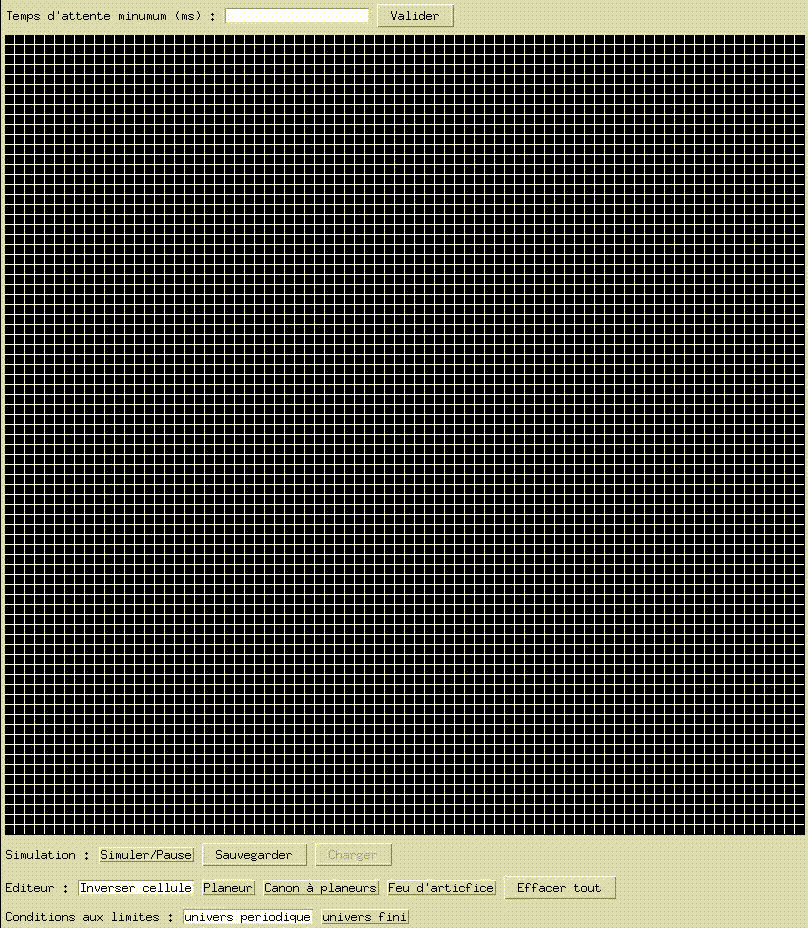

# Game of Life en Python

## Utilisation
`python3 game_of_life.py [-h] [-c CELL_SIZE] [height] [width]`

`height` : Nombre de lignes de l'univers (80 par défaut).

`width` : Nombre de colonnes de l'univers (80 par défaut).

`-c|--cell-size` : Longueur du côté d'une cellule de l'univers (10 par défaut).

`-h|--help` : affiche un message d'aide.

## Démonstration

